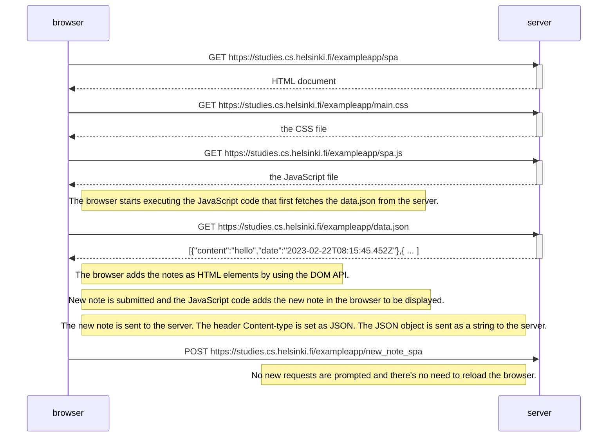

```mermaid
sequenceDiagram
    participant browser
    participant server

    browser->>server: GET https://studies.cs.helsinki.fi/exampleapp/spa
    activate server
    server-->>browser: HTML document
    deactivate server

    browser->>server: GET https://studies.cs.helsinki.fi/exampleapp/main.css
    activate server
    server-->>browser: the CSS file
    deactivate server

    browser->>server: GET https://studies.cs.helsinki.fi/exampleapp/spa.js
    activate server
    server-->>browser: the JavaScript file
    deactivate server

    Note right of browser: The browser starts executing the JavaScript code that first fetches the data.json from the server.

    browser->>server: GET https://studies.cs.helsinki.fi/exampleapp/data.json
    activate server
    server-->>browser: [{"content":"hello","date":"2023-02-22T08:15:45.452Z"},{ ... ]
    deactivate server

    Note right of browser: The browser adds the notes as HTML elements by using the DOM API.

    Note right of browser: New note is submitted and the JavaScript code adds the new note in the browser to be displayed.

    Note left of server: The new note is sent to the server. The header Content-type is set as JSON. The JSON object is sent as a string to the server.

    browser->>server: POST https://studies.cs.helsinki.fi/exampleapp/new_note_spa

    Note left of server: No new requests are prompted and there's no need to reload the browser.
```
